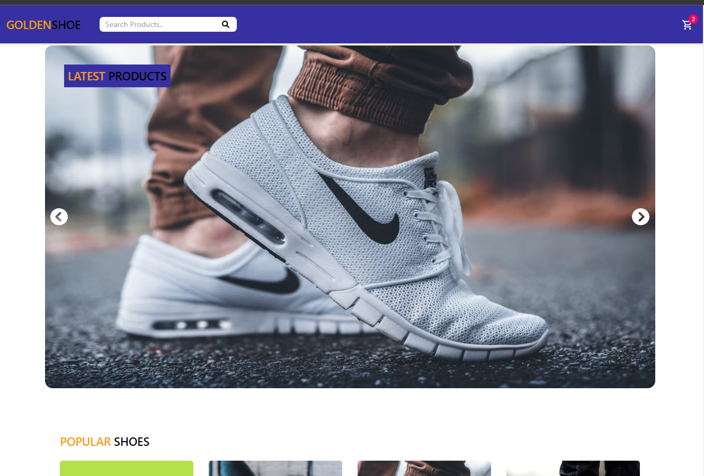

# GoldenShoe

MERN stack ecommerce shoe website

**Link to project:**

## How It's Made:

**Tech used:** Express, MongoDB, Express, React, Nodejs, Tailwind, Redux

## Tasks Solved:

- Items shows whether it is in stock or not correctly. Items that are no longer in stock will not be able to check out
- Return Process
- Filter through products
- Shoe size options for each shoe
- Shoe colour options
- Cart page shows total amount

## Features:

- Top 3 Products Carousel
- Search products filter
- Shopping Cart System
- Redux State Management
- CRUD operations
